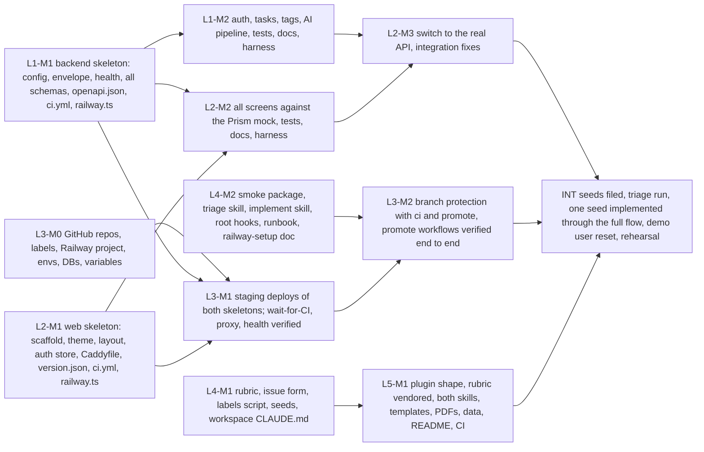

# Kaizen Tasks Workshop: Master Implementation Plan

> **For agentic workers:** This is the coordination plan. Each lane has its own task-level plan (listed in section 2) that follows the superpowers plan format. Execute lanes in parallel with superpowers:subagent-driven-development inside each lane. Never start a task before its "unblocked by" condition in this document is true.

**Goal:** Build four repositories, deployed to Railway staging and production with CI gates, plus the facilitator kit and the product skills, in time for one rehearsal before a 3-hour session on or before 2026-09-22.

**Architecture:** Five lanes work in parallel on separate repositories. The backend publishes the API contract as its first milestone so the frontend builds against a mock of it. The CI/CD lane provisions GitHub and Railway from day one with skeleton deploys, so the pipeline is verified before the applications are complete. Integration is a final short phase, not a long tail.

**Tech Stack:** TypeScript on Node 24, Express 5, Postgres, Redis and BullMQ, Anthropic SDK, React 19 with Vite, Tailwind and shadcn/ui, Playwright, GitHub Actions, Railway, Claude Code skills, hooks, and agents.

**Spec:** `docs/PRD.md` and the four design specs:
- `backend/docs/superpowers/specs/2026-09-08-kaizen-tasks-api-design.md`
- `frontend/docs/superpowers/specs/2026-09-08-kaizen-tasks-web-design.md`
- `docs/superpowers/specs/2026-09-08-kaizen-tasks-assembly-line-design.md`
- `../product-skills/docs/superpowers/specs/2026-09-08-kaizen-tasks-product-skills-design.md`

## Global Constraints

Every lane plan inherits these. They are copied from the specs and from Mike's standing rules.

- Node 24 LTS everywhere, pinned by `.nvmrc` containing `24`; `engines.node` is `>=24 <25`. Run `nvm use` before any npm command.
- Branching: work on `develop`. Feature branches come off `develop` and merge by pull request. `main` receives only `develop` by pull request after staging verification. Nothing is ever pushed to `main` directly. `develop` is the default branch on GitHub.
- Commit messages end with the two trailer lines `Co-Authored-By: Claude Fable 5.1 <noreply@anthropic.com>` and `Claude-Session: https://claude.ai/code/session_01HWmLNo9LBp2SgKdYisfRoJ`.
- Secrets never enter a repository. `ANTHROPIC_API_KEY`, `JWT_SECRET`, `ADMIN_TOKEN`, `SEED_DEMO_PASSWORD`, and any GitHub token live only in Railway variables and in git-ignored local `.env` files. Mike pastes them.
- Railway: only the new project `kaizen-tasks`. Never link to, modify, or redeploy any other project in the account. Railway operations follow the official `use-railway` skill.
- GitHub: repos `kpnemo/kaizen-tasks-api`, `kpnemo/kaizen-tasks-web`, `kpnemo/kaizen-tasks-assembly-line`, `kpnemo/kaizen-tasks-product-skills`, all public.
- TypeScript strict in every repo. ESM. Prettier formatting. ESLint flat config.
- Test first: every task shows a failing test before implementation. Tests that hit external services are opt-in and excluded from CI.
- Docs are part of every change: `CHANGELOG.md` `[Unreleased]` bullet, regenerated OpenAPI or types where applicable, ADR when an architectural file changes. The docs-check script enforces it locally and in CI.
- Migrations are additive only (ADR 0004 in the API repo).
- The API service pins `PORT=3000`; the web service proxies `/api/*` to `http://api.railway.internal:3000`.
- The workshop root folder is not a repository. `webapp/` is `kaizen-tasks-assembly-line`; `webapp/backend/` and `webapp/frontend/` are nested, git-ignored repositories; `product-skills/` is at the root.

---

## 1. Lanes

| Lane | Repo and folder | Plan file | Agent | Starts |
|---|---|---|---|---|
| L1 Backend | `kaizen-tasks-api`, `webapp/backend/` | `backend/docs/superpowers/plans/2026-09-08-kaizen-tasks-api.md` | one implementer at a time, tasks in order, with a reviewer per task | now |
| L2 Frontend | `kaizen-tasks-web`, `webapp/frontend/` | `frontend/docs/superpowers/plans/2026-09-08-kaizen-tasks-web.md` | same pattern | now, contract-independent tasks first |
| L3 CI/CD and Railway | scripts and docs in `webapp/`, settings on GitHub and Railway | `docs/superpowers/plans/2026-09-08-kaizen-tasks-cicd.md` (section 6 of this document is its task list until the lane plan is written) | one agent with the `use-railway` skill; pauses for Mike's inputs | now |
| L4 Assembly line | `kaizen-tasks-assembly-line`, `webapp/` | `docs/superpowers/plans/2026-09-08-kaizen-tasks-assembly-line.md` | same pattern as L1 | now |
| L5 Product skills | `kaizen-tasks-product-skills`, `product-skills/` | `../product-skills/docs/superpowers/plans/2026-09-08-kaizen-tasks-product-skills.md` | same pattern as L1 | now, rubric task after L4-M1 |

Lanes never edit each other's repositories. Cross-lane needs are expressed only through the interfaces in section 4.

## 2. Milestones and dependency edges

Unblock conditions, stated so an orchestrator can test them:

| Milestone | Done when |
|---|---|
| L3-M0 | Four GitHub repos exist with `develop` default and both branches pushed; labels created in the assembly-line repo; Railway project `kaizen-tasks` has `staging` and `production`, each with Postgres and Redis and the variable set from the specs, secrets pasted by Mike. Status 2026-09-08 evening: done except labels (needs L4 Task 4) and the real Anthropic key (placeholder `REPLACE_ME_WITH_REAL_KEY` is set, Mike replaces it). Project id `67adb3e0-f2af-4ad3-bbaa-32ec8a53b10e`; web domains `https://web-staging-52c0.up.railway.app` and `https://web-production-7ef71.up.railway.app` |
| L1-M1 | `npm test` and `npm run build` pass in `backend/`; `GET /api/v1/health` serves locally; `openapi.json` is committed and describes every endpoint in the API spec section 4.4 with request and response schemas; `ci.yml` is green on `develop` |
| L2-M1 | `npm test` and `npm run build` pass in `frontend/`; `dist/version.json` exists after build; `Caddyfile` and `.railway/railway.ts` committed; `ci.yml` green on `develop` |
| L4-M1 | `rubric/readiness.md` with a `version:` line, the issue form, `scripts/setup-labels.sh`, four seeds, root `CLAUDE.md` committed on `develop` |
| L3-M1 | Staging `web` domain serves the app shell and `/version.json`; staging `web` domain `/api/v1/health` returns the API's commit SHA through the proxy; a push to `develop` in either repo shows a Railway deployment waiting on CI |
| L1-M2 | Every task in the backend plan done; the opt-in live test passes once with Mike's key |
| L2-M2 | Every screen works against `npm run mock`; every test in the web spec section 6 exists and passes |
| L4-M2 | `smoke/` passes locally against staging; both skills run end to end against the seeds in dry-run; runbook and railway-setup docs complete |
| L5-M1 | `/refine-request` and `/synthesize-interviews` run from a fresh clone; PDFs built; CI green |
| L2-M3 | `VITE_PROXY_TARGET=http://localhost:3000 npm run dev` works against the real API with no console errors on the main flows |
| L3-M2 | Branch protection on `develop` and `main` in both app repos requires `ci`, and `main` also requires `promote`; one `develop` to `main` promotion in each repo has passed the smoke gate |
| INT | Seeds filed and triaged with labels and the Triage board; seed 01 implemented by `implement-issue`, merged to `develop` by Mike, promoted to `main`, visible in production; demo user reset; a timed full rehearsal of Part 1 recorded in the runbook |

## 3. What each lane can start immediately

- **L1 Backend:** everything in L1-M1, then the rest. Nothing in the backend waits on another lane. Mike's key is needed only for the opt-in live test.
- **L2 Frontend:** scaffold, theme, layout, routing shell, auth store and client middleware against a hand-written stub of the contract's auth paths, test infrastructure with MSW, docs and harness files. The moment L1-M1 lands, pull the contract, generate types, start the screens against the Prism mock.
- **L3 CI/CD:** GitHub repos and labels now; Railway project, environments, databases, and variables now; services connect when each skeleton milestone lands.
- **L4 Assembly line:** rubric, issue form, labels script, seeds, workspace CLAUDE.md, setup-workspace script now; smoke package now against any URL with a local stack; triage and implement skills now in dry-run mode against the seeds as files; runbook and railway-setup doc now, with URLs filled at L3-M1.
- **L5 Product skills:** plugin shape, both skills, templates, PDFs, transcripts, README, CI now; vendor the rubric from the local `webapp/rubric/readiness.md` the moment L4-M1 lands, and point the sync script at GitHub.

## 4. Interfaces between lanes

These are the only things a lane may assume about another lane. Exact names matter.

| Interface | Producer | Consumer | Contract |
|---|---|---|---|
| API contract | L1 | L2 | `openapi.json` at the API repo root, also served at `GET /api/v1/openapi.json`. Pulled by `frontend/scripts/pull-openapi.sh [ref]` from `https://raw.githubusercontent.com/kpnemo/kaizen-tasks-api/<ref>/openapi.json`, or `--local <path>` for the nested checkout |
| Health | L1 | L3, L4 | `GET /api/v1/health` returns `{ "data": { "status": "ok", "commit": "<sha>", "env": "<name>", "checks": { "db": "ok", "redis": "ok" } } }`, 503 with error code `UNAVAILABLE` when a check fails |
| Web version | L2 | L3, L4 | `GET /version.json` on the web domain returns `{ "commit": "<sha>", "builtAt": "<iso>" }`, never cached |
| Proxy | L2 | L1, L3 | `Caddyfile` proxies `/api/*` to `http://api.railway.internal:3000`; the API service sets `PORT=3000` |
| Smoke package | L4 | L1, L2 workflows | `kaizen-tasks-assembly-line` at `main`, folder `smoke/`, `npm ci && SMOKE_BASE_URL=<url> npm test`; env `SMOKE_AI_TIMEOUT_MS`, `SMOKE_FAST` |
| Check names | L1, L2 | L3 | Workflow and job ids `ci` and `promote` in both app repos |
| Labels | L4 | L4 skills, L5 docs | `feature-request`, `clarity:1..5`, `complexity:1..5`, `risk:1..5`, `arch-change`, `triaged`, `implementing`, `shipped`, `triage-board` |
| Rubric | L4 | L5 | `rubric/readiness.md` with a front-matter `version:` line; L5 copies it to the same relative path and compares versions |
| Per-repo skills | L1, L2 | L4 implement skill | `backend/.claude/skills/add-api-endpoint/SKILL.md`, `frontend/.claude/skills/add-frontend-feature/SKILL.md`, `write-adr`, `release-notes` in both |
| Docs-check | L1, L2 | L4 root hook | `scripts/docs-check.sh --hook` in each repo, exit 2 on failure with the fix list on stdout; never exits 0 while printing FAILED after the escape hatch |
| Railway services | L3 | L1, L2 | Project `kaizen-tasks`; services `api`, `web`, `Postgres`, `Redis` in `staging` and `production`; variables named exactly as in the API spec section 2.4 and web spec section 2.3 |
| Seed reset | L1 | L4 runbook | `POST /api/v1/admin/seed-reset` with header `x-admin-token`; demo user `demo@kaizen.local` |
| Smoke selector contract | L4 | L2 | The smoke test finds the web app only by accessible roles and names, listed in `smoke/README.md` section "Selector contract" of the assembly-line repo. The web app's components and tests use those exact names |
| Web port | L3 | L2 | The Railway `web` service sets `PORT=8080`; the `Caddyfile` binds `:{$PORT}`; the API service sets `PORT=3000` |
| Wait-for-CI | L3 | L1, L2 | Set through the service config field `source.checkSuites: true` per environment; already on for `api` and `web` in both environments since 2026-09-08 |

## 5. Mike's inputs, and when they block

| Input | Needed by | Blocks |
|---|---|---|
| Paste `ANTHROPIC_API_KEY` into Railway staging and production, and into `backend/.env` | L3-M0, L1 live test | AI breakdowns on staging; the opt-in live test |
| Generate and paste `JWT_SECRET`, `ADMIN_TOKEN`, `SEED_DEMO_PASSWORD` per environment (L3 offers generated values) | L3-M0 | Deploys |
| Wait-for-CI: no input needed. It is the config field `source.checkSuites`, already true on `api` and `web` in both environments. The dashboard visit in the CI/CD plan only records the toggle's label for the runbook | L3-M1 | nothing |
| Accept the Railway GitHub app for the two app repos if prompted | L3-M0 | Connecting services |
| Merge pull requests from `develop` to `main` after staging verification, in every repo | L3-M2, INT | Production and the promote gate proof |
| Optional: authorize the orchestrator to merge `develop` into `main` during the build phase only | L3-M2 | Otherwise each promotion waits for Mike |
| The rehearsal, timed | INT | Runbook timings |

## 6. L3 CI/CD lane task list

L3 is procedural rather than code-heavy, so its tasks live here. Each ends with a verifiable state.

1. **GitHub repos.** For each of the four repos: `gh repo create kpnemo/<name> --public --source . --push` from the repo folder on `develop`, then push `main`, then `gh repo edit --default-branch develop`, description from the spec's first line. Verify: `gh repo view` shows `develop` as default and both branches exist.
2. **Labels.** Run `webapp/scripts/setup-labels.sh` once L4-M1 provides it; until then create `feature-request` by hand. Verify: `gh label list` shows the set.
3. **Railway project.** From `webapp/backend/` on Mike's account: `railway init` naming `kaizen-tasks`; `railway environment new staging`. Verify: `railway status` shows the project and both environments, and `railway list` shows no other project was touched.
4. **Databases and variables.** In each environment add Postgres and Redis; create service `api` linked to `kpnemo/kaizen-tasks-api` and service `web` linked to `kpnemo/kaizen-tasks-web` with the branch for that environment; set variables per the specs with references `${{Postgres.DATABASE_URL}}` and `${{Redis.REDIS_URL}}`, `PORT=3000` on `api`, `APP_ENV`, `WORKER_ENABLED=true`, `AI_MODEL=claude-sonnet-5`, `AI_RATE_LIMIT_PER_HOUR=20`, `AI_GLOBAL_LIMIT_PER_HOUR=300`, `AI_ENABLED=true`, `AI_STALE_MINUTES=10`, `SEED_DEMO_USER=true`, `LOG_LEVEL=info`; pause for Mike to paste the secrets. Verify: `railway variables` lists every name in both environments.
5. **Apply IaC and first deploys** after L1-M1 and L2-M1: `railway config apply` per environment in each app repo; generate a public domain for `web` in each environment; ask Mike to switch wait-for-CI on. Push a trivial commit to `develop` in each repo and watch the deployment wait for CI, then deploy. Verify L3-M1 conditions with `curl`. Record the two web domains in `docs/runbook.md`.
6. **Branch protection** after both repos' `ci` has run at least once and `promote` exists: run `webapp/scripts/protect-branches.sh` for both app repos. Verify with `gh api repos/<repo>/branches/main/protection`.
7. **Promotion proof** after L4-M2: open a `develop` to `main` PR in each repo, watch `promote` pass against staging, Mike merges, production deploys. Verify: production `/version.json` and `/api/v1/health` show the merged SHAs.
8. **Runbook Railway sections.** Fill the click paths for wait-for-CI, rollback, and variable changes with what was actually seen in the dashboard.

## 7. Execution protocol

- One orchestrator runs the lanes. For each lane it dispatches one implementer subagent per task from that lane's plan, in order, then one reviewer subagent that checks the task's diff against the spec and the plan's stated test evidence. A task is done only when the reviewer passes it and the tests it names ran green. Different lanes run concurrently; tasks inside a lane run sequentially.
- Every lane commits to its repo's `develop` in small commits with the required trailers. No lane pushes to `main`.
- The orchestrator checks the unblock conditions in section 2 before dispatching a task that depends on another lane, and re-checks after each milestone.
- Blocking inputs from section 5 are requested from Mike once, batched, as early as possible; lanes that do not need them keep running.
- Integration (INT) runs from the workspace root with the assembly-line's own skills, exactly as the session will, and the runbook is corrected from what actually happened.

## 8. Self-review against the specs

Spec coverage: the PRD's four repos map to L1, L2, L4, L5; the PRD's pipeline (section 7) and Railway setup map to L3 with the app repos owning their workflow files; the PRD's runbook and rehearsal are L4-M2 and INT. Each lane plan is self-reviewed against its own spec by its author. Interfaces in section 4 are the complete list of cross-repo assumptions found in the four specs; anything a lane plan assumes about another repo that is not in section 4 is a plan defect to fix here first.
